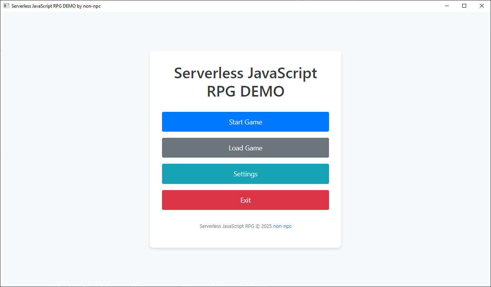
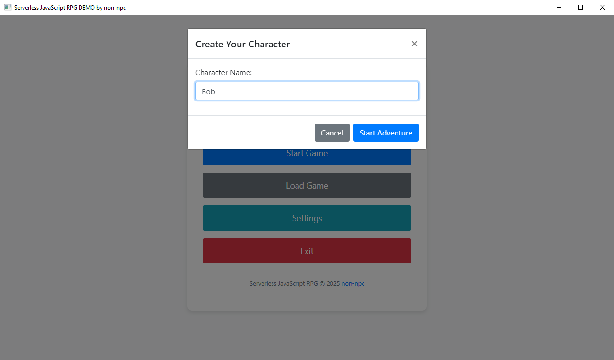
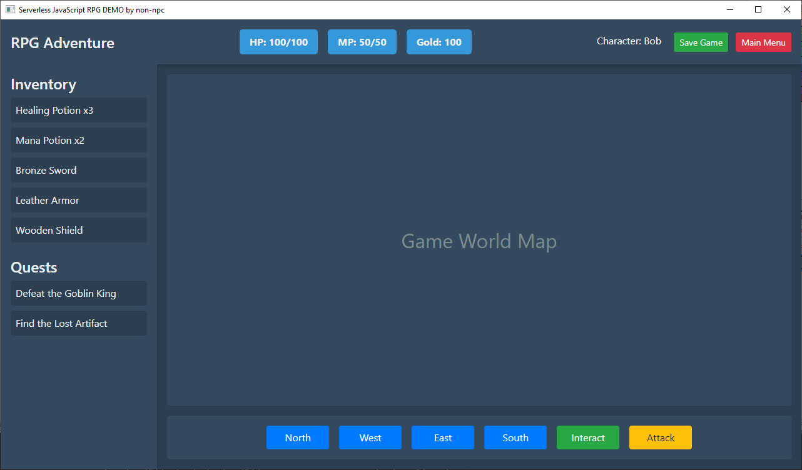
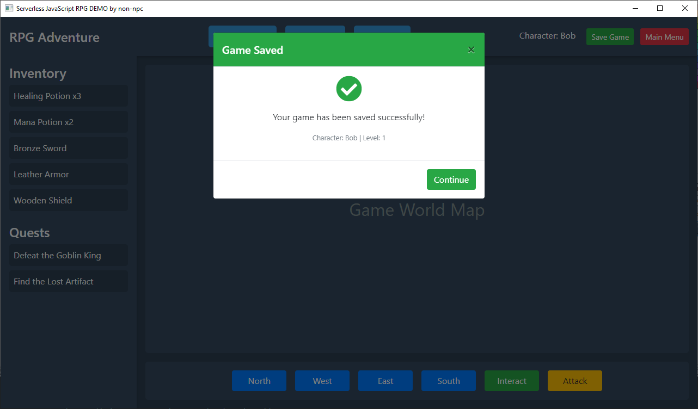
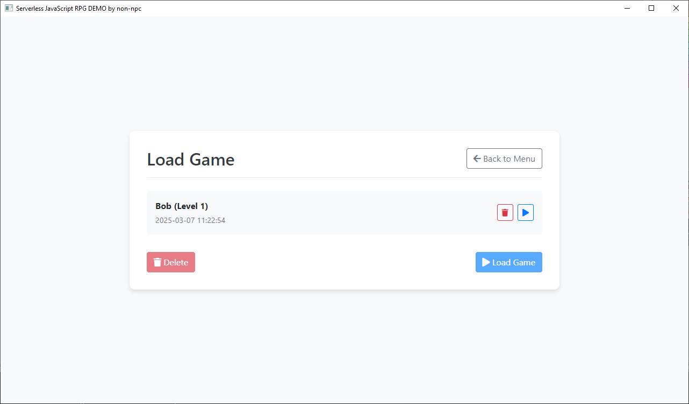

# Nodeless Desktop Javascript Python

A windows desktop application framework that seamlessly integrates Python backend with JavaScript frontend using PyQt6 WebView, enabling the development of rich desktop applications without the need for Node.js, NPM and all that jazz.

## Features

- **Seamless Python-JavaScript Integration**: Direct communication between Python backend and JavaScript frontend via QWebChannel
- **Modern Web Technologies**: 
  - Use HTML5, CSS3, and vanilla JavaScript without Node.js dependencies
  - Bootstrap-based responsive UI components
  - FontAwesome icons integration
- **Rich Desktop Capabilities**:
  - Native file system access through Python backend
  - Local data persistence and file management
  - Custom window controls and native OS integration
- **Game Development Features**:
  - Save/Load game system with file management
  - Dynamic UI updates and state management
  - Modal dialogs and user confirmations
- **Developer-Friendly Architecture**:
  - Clean separation of frontend and backend concerns
  - Easy-to-understand communication protocol
  - No build tools or complex setup required

In the game you can currently click "Attack" and you will lose HP.
You can save and load game state and your data will be saved/loaded.

## Screenshots






## Requirements

- Python 3.8 or higher
- PyQt6 and PyQt6-WebEngine

## Installation

1. Clone this repository:
   ```
   git clone https://github.com/yourusername/serverless_js_rpg.git
   cd serverless_js_rpg
   ```

2. Create a virtual environment (optional but recommended):
   ```
   python -m venv venv
   ```

3. Activate the virtual environment:
   - Windows:
     ```
     venv\Scripts\activate
     ```
   - macOS/Linux:
     ```
     source venv/bin/activate
     ```

4. Install the required packages:
   ```
   pip install -r requirements.txt
   ```

## Running the Game

Simply run the main.py file:

```
python main.py
```

## Project Structure

- `main.py`: The main Python application that creates the PyQt6 WebView
- `appdata/`: Directory containing web assets
  - `index.html`: The main menu HTML file
  - `qwebchannel.js`: JavaScript library for QWebChannel communication

## How It Works

The application uses PyQt6's WebEngineView to display HTML content. Communication between the JavaScript frontend and Python backend is handled through QWebChannel. The HTML/JS content is loaded from the appdata directory.

## License

CC0 